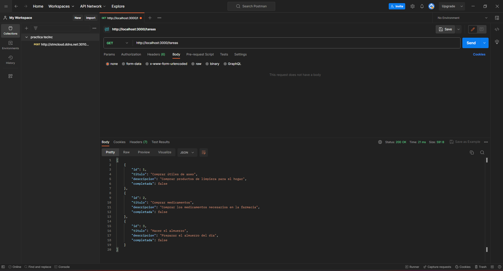
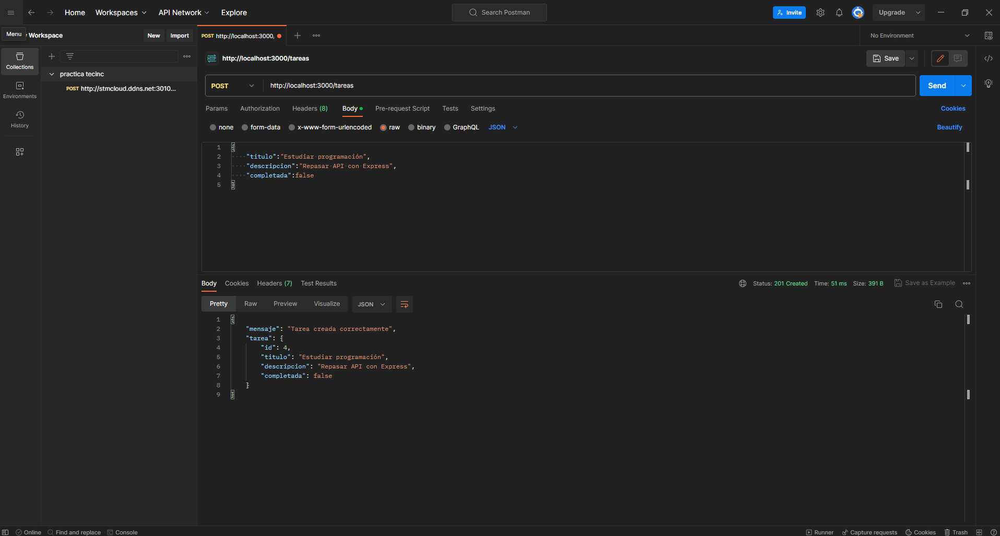
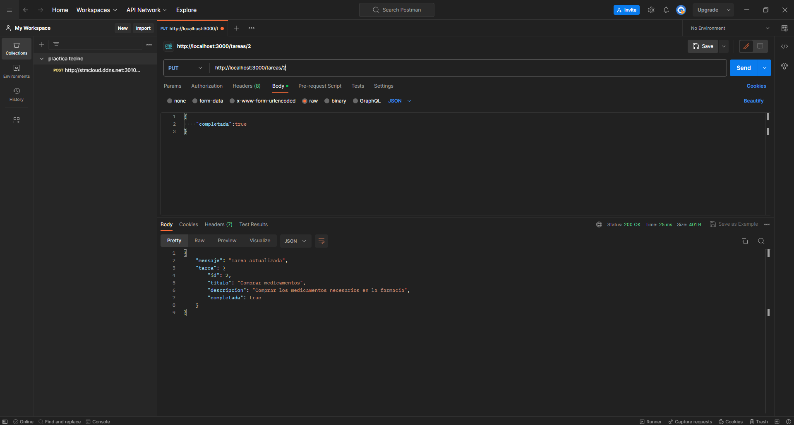
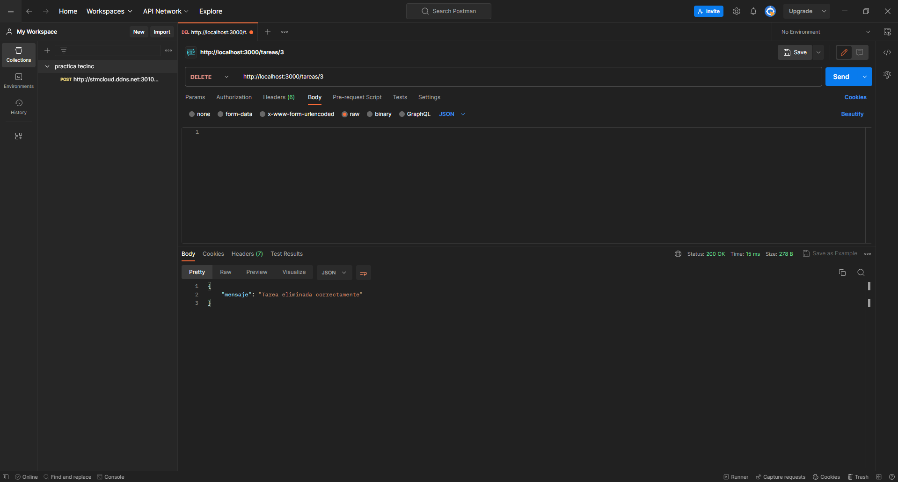
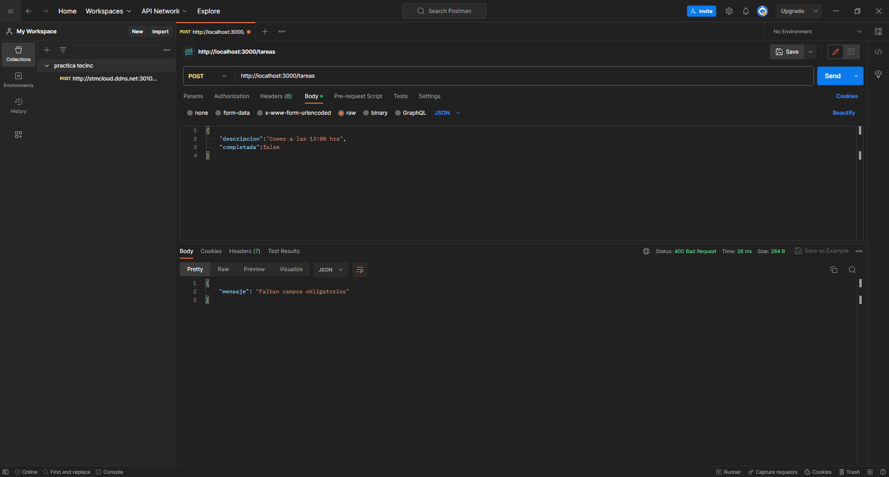

# ToDo API Express

## Descripción del proyecto

Esta aplicación consiste en una API REST desarrollada utilizando Node.js y Express.js.

La API permite administrar tareas mediante operaciones CRUD:

- Crear tareas.
- Consultar tareas.
- Actualizar tareas.
- Eliminar tareas.

Los datos son almacenados en un archivo JavaScript externo llamado data.js mediante un arreglo de objetos, sin la utilización de base de datos.

## Tecnologías utilizadas

- Node.js
- Express.js
- JavaScript
- Postman para pruebas

# Instalación

Clonar el repositorio:

git clone URL_DEL_REPOSITORIO

Instalar las dependencias:

npm install

# Ejecución del proyecto

Para iniciar el servidor ejecutar:

node index.js

La API estará disponible en:

http://localhost:3000

# Estructura del proyecto

Todo-API-Express

├── index.js

├── routes.js

├── data.js

├── package.json

└── README.md

# Endpoints

## GET - Obtener todas las tareas

Método:

GET

Ruta:

/tareas

Permite consultar todas las tareas disponibles.

## POST - Crear una tarea

Método:

POST

Ruta:

/tareas

Ejemplo:

{
    "titulo":"Estudiar programación",
    "descripcion":"Repasar API con Express",
    "completada":false
}

## PUT - Actualizar una tarea

Método:

PUT

Ruta:

/tareas/:id

Ejemplo:

/tareas/2

JSON:

{
    "completada":true
}

## DELETE - Eliminar una tarea

Método:

DELETE

Ruta:

/tareas/:id

Ejemplo:

/tareas/3

# Validaciones

La API valida:

- Que los campos obligatorios existan.
- Que completada sea un valor booleano.
- Que la tarea exista antes de modificar o eliminar.

Códigos utilizados:

200 → Operación exitosa.

201 → Registro creado correctamente.

400 → Datos inválidos.

404 → Recurso no encontrado.

# Pruebas realizadas

Las pruebas fueron realizadas utilizando Postman.

## GET - Listar tareas

## POST - Crear tarea

## PUT - Actualizar tarea

## DELETE - Eliminar tarea

## Validación de error 400

